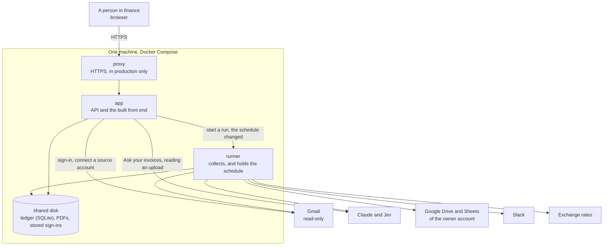
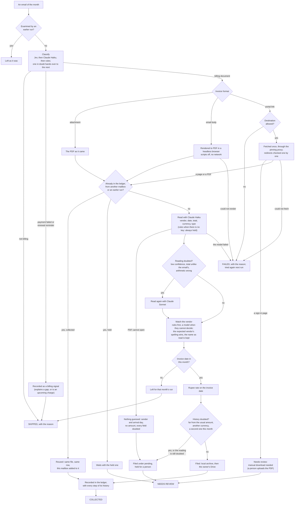
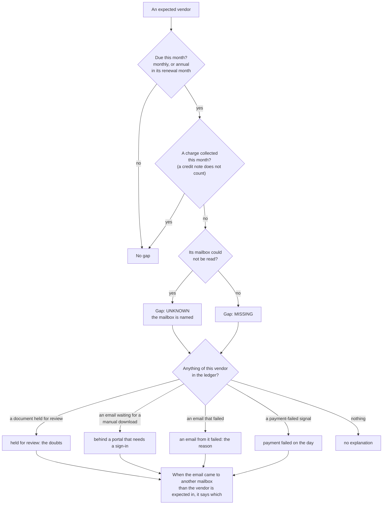
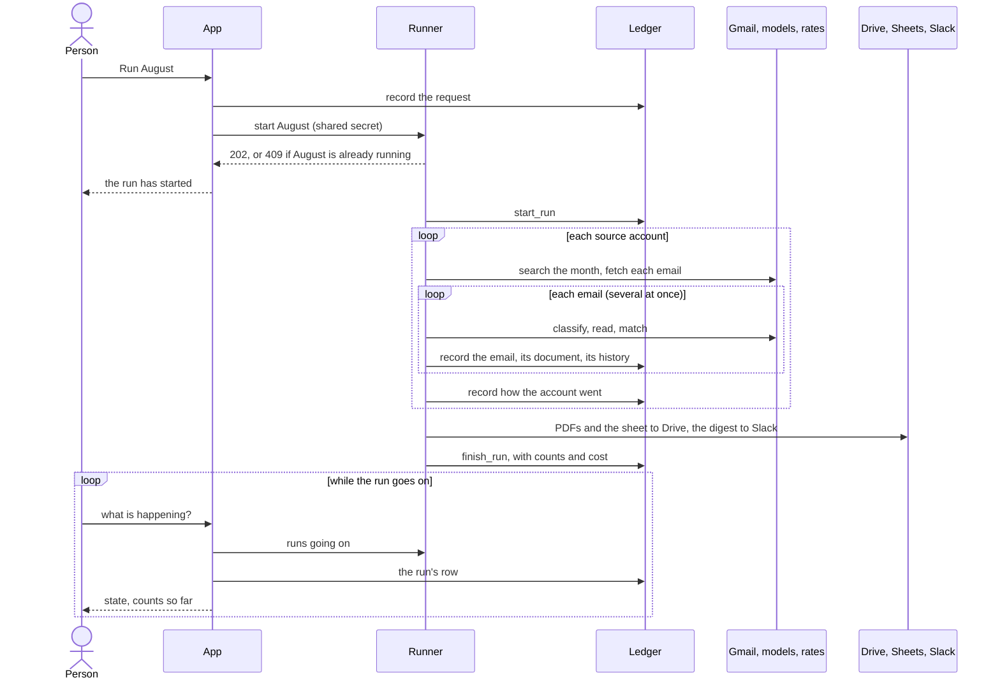
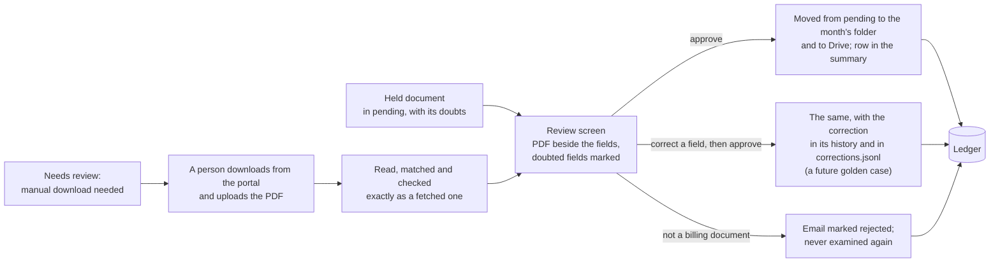
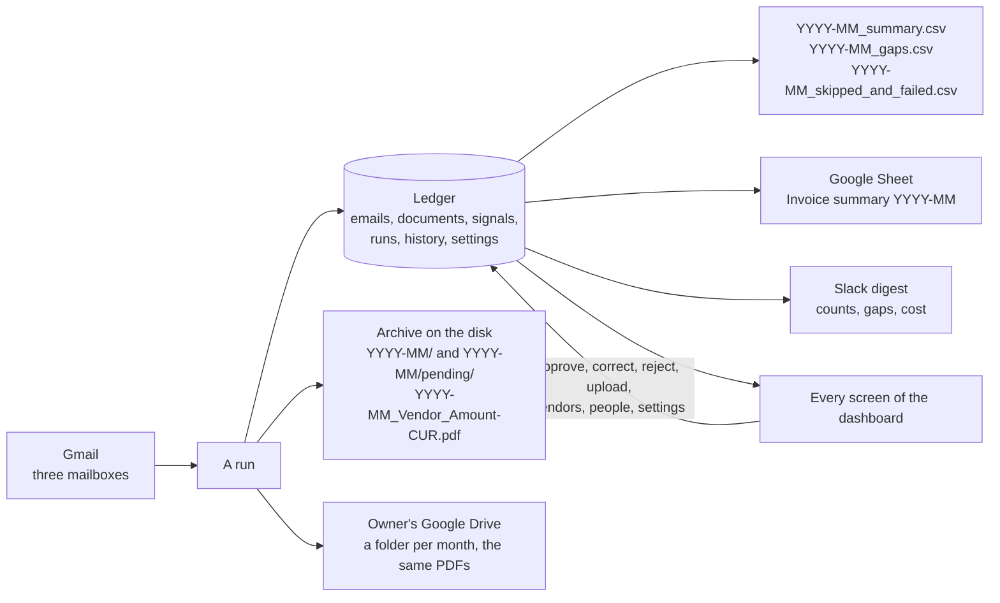

# Architecture

How the tool is put together today. The reasons for each choice are in [DECISIONS.md](DECISIONS.md) and the records in `docs/adr/`. Where this design stops being enough, and what comes next, is in [docs/research/scaling.md](docs/research/scaling.md). The words used here are defined in [CONTEXT.md](CONTEXT.md).

## In one picture

## Three roles

| Role | What it does | What it never does | Where it lives |
|---|---|---|---|
| Front end | The screens | Holds a secret | `frontend/`, built to static files that the app serves |
| App | Serves the API and the front end, signs people in, records what they decide | Collects | `backend/src/invoice_collector/api/` |
| Runner | Collects a month, on the schedule or when the app asks | Serves a page | `backend/src/invoice_collector/runner/` |

The app and the runner are one codebase and one container image, started with different commands. They share a disk and nothing else. The app asks the runner over the private network between them and proves itself with a shared secret. Nothing polls.

The command line is a fourth way to the same code, for the people who build and operate the tool. It starts the same run the runner starts (ADR 0010).

## A run

A run collects one collection month. It is one function, `run_collection`, whoever starts it.

```mermaid
flowchart LR
    discover["Discover<br/>emails of the month,<br/>from each source account"]
    classify["Classify<br/>billing document,<br/>billing signal, or neither"]
    route["Route<br/>by invoice format"]
    fetch["Get the document<br/>attachment, email body,<br/>or portal link"]
    extract["Read<br/>vendor, date, total,<br/>currency, type"]
    match["Match<br/>to an expected vendor"]
    check["Check<br/>the reading and<br/>the vendor's history"]
    again["Read again<br/>with the stronger model"]
    hold["Hold for review"]
    store["File and record"]
    report["Report<br/>summary, sheet, digest"]
    reconcile["Reconcile<br/>gaps and suggestions"]

    discover --> classify --> route --> fetch --> extract --> match --> check
    check -->|no doubt| store
    check -->|doubt| again --> check
    again -->|still in doubt| hold
    store --> report --> reconcile
    hold --> report
```

| Stage | What decides | Module |
|---|---|---|
| Discover | A Gmail search for the month and some days either side, then the exact arrival time | `gmail_source.py`, `mail_source.py` |
| Classify | Jev, then Claude Haiku, then rules. One in doubt hands over to the next (ADR 0009) | `classifier.py`, `jev_classifier.py`, `claude_classifier.py` |
| Route | Rules on what the email carries | `routing.py` |
| Get the document | An attachment as it is. An email body rendered to PDF. A portal page fetched and rendered | `browser.py`, `renderer.py`, `portal.py` |
| Read | Claude Haiku. Rules when there is no key, and then the reading is held | `claude_extractor.py`, `rule_extractor.py` |
| Match | Rules first, a model for what rules cannot decide. The expected vendor's spelling wins (ADR 0016) | `vendor_matcher.py`, `claude_vendor_matcher.py` |
| Check | The document's own arithmetic, the email it came in, and what the vendor billed before | `checks.py` |
| Read again | Claude Sonnet, only for a doubted reading (ADR 0008) | `claude_extractor.py` |
| File and record | The archive, then the ledger | `archive.py`, `drive_archive.py`, `ledger.py` |
| Report | The summary, the Google Sheet, the digest | `summary.py`, `sheet_summary.py`, `digest.py` |
| Reconcile | Expected vendors against what was collected | `reconciler.py`, `gap_report.py` |

Three rules hold across every stage.

- **Nothing is dropped in silence** (ADR 0005). Every email ends as collected, needs review, skipped or failed, with a reason.
- **A run only adds** (ADR 0013). What an earlier run collected is never taken away by a later one.
- **What an email says is data** (ADR 0012). It is never an instruction to a model, never a page with scripts, and never a formula in a sheet.

### One email, end to end

Every email the discover stage finds goes through this, and comes out in exactly one of the four states at the bottom. The diagram is `_Examination` in `run.py`.

What is not in the picture: an examination that raises something unexpected is tried again after 10 and 20 seconds, and then recorded as failed; a document collected by an earlier run is never taken away, whatever this run makes of the same email; and when several documents come in one email, the whole email waits if any one of them is held.

### How a gap gets its reason

After every email is examined, the run compares the expected vendor list with what was collected. This is `reconciler.py`.

A renewal reminder becomes an upcoming charge, and a vendor that billed but is on no list becomes a suggestion on the Vendors screen.

### Who starts a run, and what follows

From the dashboard:

On the schedule, the runner starts the same run itself: its timer fires on the chosen day, it checks the settings again in case the day changed while the app could not tell it, starts the month that has just ended through the same `RunStarter`, and sets the timer for next month. When the runner starts after being off, it looks once for a run that was due meanwhile and performs it.

From the command line, `invoice-collector collect` calls the same function directly, with no runner and no app.

### The review loop

A held document waits for a person. Nothing reaches the summary until they decide.

## The ledger

The ledger is the source of truth. The summary, the sheet, the archive's names and every screen of the dashboard are views of it. It is one SQLite file on the shared disk.

| Holds | For |
|---|---|
| Emails examined, with their state and reason | Nothing dropped in silence; starting a run again |
| Billing documents collected, and those held | The summary; the Review screen |
| Billing signals | Explaining gaps; upcoming charges |
| Expected vendors, with their status | Gaps and suggestions |
| Runs, what each source account gave, and what the models cost | The Runs screen; the digest |
| The history of each billing document | The audit trail |
| People, source accounts and settings, each with its history of changes | Who may do what; what the tool reads; the schedule |

Every connection to it is opened in one place, `database.py`, with write-ahead logging and a wait when another process is writing. That is what lets the app and the runner write the same file, and it is the one place to change when the ledger moves to a database on the network.

A billing document is known by what it was made from: the bytes of an attachment, the body of an email, or the address of a portal page (ADR 0013). That is why running a month again reads nothing twice.

### From the ledger to what people see

The archive holds the files; the ledger holds what they are. A PDF's name, its row in the summary and its place in the gaps all come from the ledger, so correcting a field on the Review screen changes all three at once.

## The dashboard

| Screen | What a person does there |
|---|---|
| Summary | Sees the month: billing documents, rupee totals, gaps with what explains them, upcoming charges |
| Review | Corrects, approves or rejects a held document. Uploads a PDF fetched by hand from a portal that needs a sign-in |
| Vendors | Keeps the expected vendor list. Accepts or ignores a suggested vendor |
| Spend | Sees spend in rupees by month, vendor and source account |
| Questions | Asks about invoices in plain words. A model chooses one of a fixed set of queries; the numbers come from the ledger (ADR 0007) |
| Runs | Sees past runs with their counts and cost. Runs a month, or one failed source account, again |
| Source accounts | Connects, renews and removes the mailboxes the tool reads. Chooses the owner account |
| Settings | Chooses the day of the schedule and the Drive folder |
| People | Administrators decide who may sign in |
| History of a document | Sees every step a billing document went through, and every correction |

A person signs in with Google. That proves who they are; the list of people decides whether they are let in (ADR 0014). The check is made on every request.

## What goes where

| Data | Where it is kept | Who else receives it |
|---|---|---|
| Emails | Read from Gmail, not kept | The text of an email goes to Jev or Claude to be classified |
| PDFs | The archive on the shared disk, and the owner account's Drive | A PDF goes to Claude to be read |
| The ledger | The shared disk | Nobody |
| Stored sign-ins | The shared disk, readable by their owner alone | Nobody. Never sent to the browser |
| API keys, the OAuth client, the secrets | The environment, set by whoever deploys | Nobody |
| The digest | Not kept | Slack |

The tool asks Google for leave to read mail and nothing more. Only the owner account is also asked for the Drive files the tool itself creates (ADR 0002).

## Every outside service has a stand-in

Each module that reaches outside is an interface with a real implementation and a fake one. Tests use the fakes or replay recorded responses, and never reach a live service.

| Interface | Real | In tests |
|---|---|---|
| Mail source | Gmail | Emails in memory, or sample files |
| Classifier, extractor, vendor matcher | Jev, Claude, rules | Prepared answers, recorded responses |
| Renderer and portal fetcher | Headless Chromium | A fake that returns fixed bytes |
| Exchange rates | Frankfurter | Fixed rates |
| Archive | A folder, Google Drive | A fake Drive in memory |
| Summary writer | CSV, Google Sheets | A fake Sheets in memory |
| Digest sender | A Slack webhook | A recorder |
| Runner, as the app sees it | The runner service | A fake runner |
| Google sign-in | Google | A stand-in the real service never uses |

## How it is tested

| Seam | What it proves | Where |
|---|---|---|
| The run | A month collected from sample mail gives the right ledger, summary and gaps | `backend/tests/test_run_*.py` |
| The dashboard's API | Each route does what the screen needs, and refuses what it must | `backend/tests/test_api_*.py` |
| Adapters | Each outside service is spoken to correctly, against recorded responses | `backend/tests/test_*` beside each adapter |
| Screens | Each screen shows what the API gives | `frontend/src/*.test.tsx` |
| The browser | The real front end against the real app, in a real browser | `backend/tests/browser/` |
| The offline eval | How often each model is right, on sample mail whose answers are known | `backend/src/invoice_collector/evals/`, `backend/evals/` |

The eval compares answers exactly and uses no model as a judge (ADR 0011). A fall in accuracy against the recorded baseline fails the build.

## How it is deployed

One machine runs Docker Compose. The same Compose file runs on a developer's machine, on a reviewer's machine and in production; production adds the proxy.

| Piece | On a developer's or reviewer's machine | In production |
|---|---|---|
| Address | `http://localhost:8000` | A name of our own, over HTTPS |
| Proxy | None | Caddy, which gets the certificate |
| App and runner | The same image | The same image |
| Disk | A Docker volume | A Docker volume on the machine's disk, backed up |
| Secrets | A `.env` file | A `.env` file readable by the service alone |

See ADR 0017 for why one machine, [docs/deploy.md](docs/deploy.md) for the steps, and `docs/research/scaling.md` for what replaces it.

## The repository

| Path | What is there |
|---|---|
| `backend/src/invoice_collector/` | The run, the adapters, the ledger |
| `backend/src/invoice_collector/api/` | The app |
| `backend/src/invoice_collector/runner/` | The runner |
| `backend/src/invoice_collector/evals/` | The offline eval |
| `backend/src/invoice_collector/seed/` | The generator of the sample mail |
| `backend/samples/` | The sample mail and its answers |
| `backend/evals/` | The scorecard, the baseline and the hard golden set |
| `backend/tests/` | Tests, with recorded responses in `recorded/` |
| `frontend/src/` | The screens and their tests |
| `docs/adr/` | Architecture decision records |
| `docs/research/` | Cost and latency, scaling, and what was learned of Jev |
| `docs/sample-output/` | The output of one run, for August 2026 |
| `docs/deploy.md` | Deploying on one machine |
| `docs/agents/` | How issues and labels are used |
