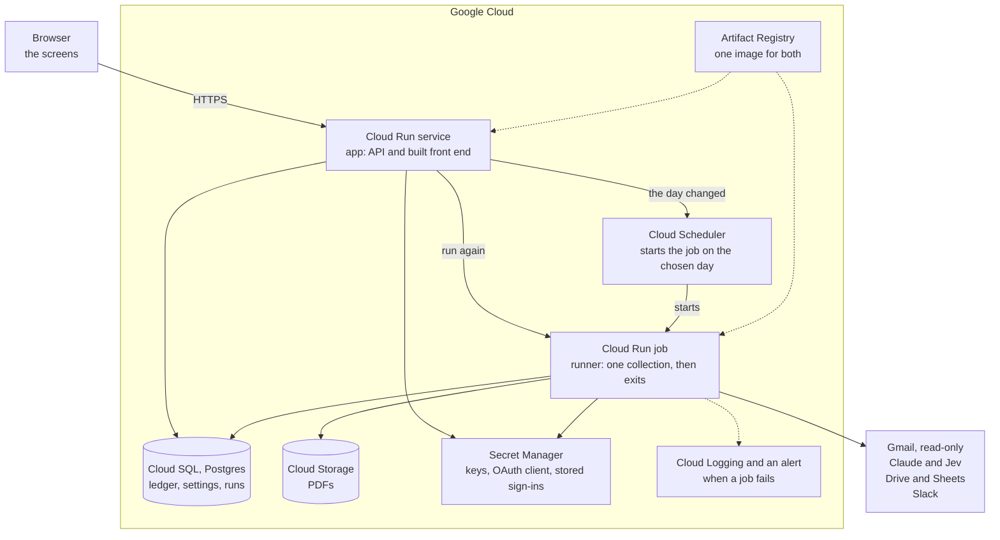

# Scaling: where the design stops, and what comes next

The tool runs on one machine with SQLite (ADR 0017). This document says where that design stops being enough, in what order, and what the architecture becomes then. None of it is built. It is here so the path is known before it is needed.

## What the tool handles today

| | Today | Measured or estimated |
|---|---|---|
| Source accounts | 3 | |
| Billing documents a month | About 40 | |
| Time for a run | About 2 minutes | Measured, over three real mailboxes |
| Model cost of a run | About $0.06 | Measured, as the run records it |
| Time to read one document | 2 to 6 seconds | Measured in the extraction spike and the eval |

## What breaks first

The order below is an estimate. None of these limits has been reached or tested. The first would be worth measuring with a load test over a few hundred generated emails before anything is changed.

| What breaks | Roughly when | What to do | Size of the change |
|---|---|---|---|
| A run takes too long, reading one email after another | Around a thousand documents a month | Read several emails at once. The run already can, with a limit on how many | A setting |
| Gmail and the models limit the rate of calls | The same range | Lower the limit on how many are read at once, and retry with backoff, which the run already does | A setting |
| The machine runs out of memory during a run | Many headless browser pages at once | A larger machine, or the runner on a machine of its own | Small |
| One machine must not be a single point of failure | When the dashboard must stay up | The architecture below | Large |
| Two machines must write to the ledger | When the runner and the app are apart | Postgres | Large |
| A second company uses the tool | The first customer who is not us | Workspaces: every row belongs to one | Large |

The first three are settings and machine sizes. The last three are the change of architecture this document is about.

## The architecture to move to

| Need | Service | Why this one |
|---|---|---|
| Dashboard and API | Cloud Run service | Adds instances under load and costs nothing while idle. Gives an HTTPS address |
| A collection | Cloud Run job | Runs for minutes and exits. Several can run at once, one for each source account |
| When to run | Cloud Scheduler | Starts the job on the day chosen in the dashboard, which the app writes to it |
| Ledger | Cloud SQL, Postgres | The app and the job are separate machines and cannot share a file |
| PDFs | Cloud Storage | Durable files, reached from any machine. Drive remains the copy finance sees |
| Secrets and sign-ins | Secret Manager | Nothing secret in the image or on a disk |
| Deploying | Artifact Registry and GitHub Actions | One image, deployed to both, with no stored keys |

## What changes in the code

Four things differ between one machine and this architecture. Each is behind an interface today, or is opened in one place.

| Interface | One machine | Cloud Run |
|---|---|---|
| Ledger | SQLite file | Postgres |
| PDF archive | Folder on the disk | Cloud Storage |
| Stored sign-ins | Files on the disk | Secret Manager |
| Starting a run | The app asks the runner | The app starts the Cloud Run job |
| Schedule | A timer in the runner | Cloud Scheduler, written by the app |

### The ledger on Postgres

This is the largest piece.

| Work | What it involves |
|---|---|
| One database layer | Every connection to the ledger is already opened in one place. That place chooses the database from a setting |
| Queries | Most are plain SQL that both databases accept. The few written for SQLite are rewritten in a form both accept |
| Schema changes | The hand-written additions of columns are replaced by a migration tool |
| Types | Dates and amounts are text today. Postgres has types for both |
| Tests on both | The tests stay on SQLite, which needs no server and gives each test a database of its own. A second job in CI runs the ledger and dashboard tests against a real Postgres |

SQLite stays for the tests and for the command line, where needing nothing installed is worth more than matching production.

The estimate is half a day to a day of work for the port, and as much again for the deployment. It is an estimate: the unknown is how many tests pass on SQLite and fail on Postgres.

### Reading several source accounts at once

On one machine a run reads the source accounts in turn. As jobs, each source account can be a job of its own, started together. The run already records each source account's outcome apart from the others, and running one account again leaves the others as they were, so nothing in the ledger has to change for it.

### Several companies

Every table gains the workspace its rows belong to, every query is limited to one, and signing in places a person in theirs. This is the change that touches the most code and is the hardest to add late. It is not started, and nothing in the present design prevents it.

## What it costs

These are estimates from published prices, for the volume of today. They should be checked against the pricing calculator before a decision rests on them.

| | One machine | Cloud Run |
|---|---|---|
| Compute | About $15 a month, always on | Near nothing at this use |
| Disk or database | About $2 | About $10 to $12 for the smallest Cloud SQL instance |
| Address, secrets, storage | About $4 | Under $1 |
| Total a month | About $20 | About $12 |
| Models, for each monthly run | $0.06 | $0.06 |

The two are within ten dollars of each other. The choice between them was never about money: it is about how much there is to build, to explain and to keep working, against a load that one machine handles with room to spare.

## What was decided against, and would be looked at again

| Option | Why not now | When to look again |
|---|---|---|
| Prefect, or another orchestrator | Nothing left for it to manage (ADR 0017) | Many kinds of run, with dependencies between them |
| Tracing model calls in a hosted service | The ledger records each run's cost and each document's history. It was built behind an interface and left out | Prompts changed daily by several people |
| A queue between the app and the runner | One run a month needs no queue | Runs requested faster than they finish |
